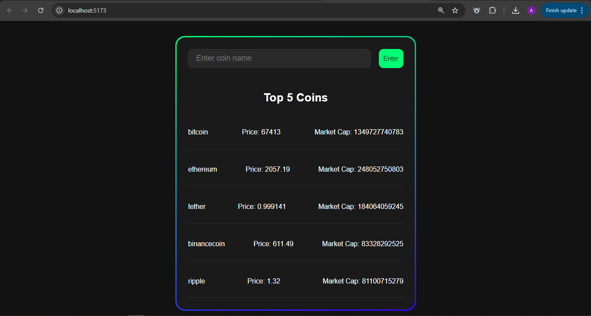
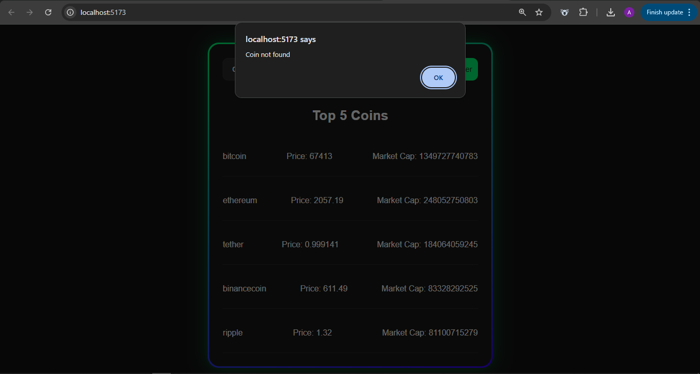
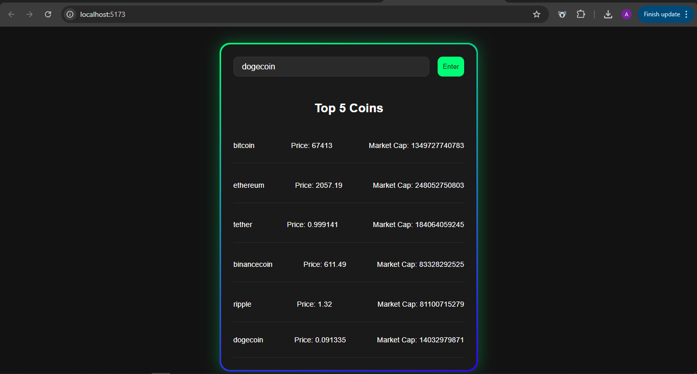

# 🪙 CoinPulse

A frontend-only React application that displays real-time cryptocurrency prices using the CoinGecko public API. Built with React and Vite — no backend, no dependencies beyond React itself.

[**🌐 Live Demo**](https://coin-pulse-six.vercel.app/)

---

## 📸 Screenshots

<p align="center">
  
   
  
</p>

---

## 🚀 Features

- **Top 5 Coins** — Automatically loads the top 5 cryptocurrencies by market cap on page load
- **Live Search** — Search any coin by its CoinGecko ID (e.g. `bitcoin`, `ethereum`, `dogecoin`)
- **Real-time Data** — Fetches live price and market cap data directly from CoinGecko
- **Error Handling** — Alerts the user if a coin is not found or the request fails
- **Clean UI** — Dark themed card layout with a gradient border

---

## 🛠️ Tech Stack

- **React 19** — UI library
- **Vite 7** — Build tool and dev server
- **CoinGecko API** — Free public crypto data API
- **Plain CSS** — No CSS framework

---

## 📁 Project Structure

```
src/
├── components/
│   ├── CoinCard.jsx       # Displays a single coin's name, price and market cap
│   ├── SearchBar.jsx      # Input and button for searching a coin
│   ├── SearchResult.jsx   # Renders the result of a search
│   └── TopCoinsList.jsx   # Renders the top 5 coins list
├── App.jsx                # Root component — holds all state and API logic
├── main.jsx               # Entry point
└── index.css              # Global styles
```

---

## ⚙️ Getting Started

### Prerequisites
- Node.js installed
- Internet connection (for live API data)

### Installation

```bash
# Clone the repository
git clone https://github.com/Anandhu9255/CoinPulse.git

# Navigate into the project
cd CoinPulse

# Install dependencies
npm install

# Start the development server
npm run dev
```

Then open `http://localhost:5173` in your browser.

---

## 📡 API Used

This project uses the [CoinGecko API](https://www.coingecko.com/en/api) — no API key required for basic usage.

**Endpoints used:**

| Purpose | Endpoint |
|---|---|
| Top 5 coins | `GET /coins/markets?vs_currency=usd&order=market_cap_desc&per_page=5` |
| Search a coin | `GET /coins/markets?vs_currency=usd&ids={coinName}` |

> **Note:** The free tier has rate limits. If you see a 429 error, wait 1-2 minutes before trying again. For higher limits, register for a free API key at coingecko.com.

---

## 🧠 What I Learned

This project was built to practice core React concepts:

- `useState` and `useEffect` for managing data and side effects
- Async/await for handling API calls
- Props and component composition
- Conditional rendering
- Lifting state up to a parent component
- Controlled inputs

---

## 🙏 Acknowledgements

- Data provided by [CoinGecko](https://www.coingecko.com)
- Button styling from [UIverse](https://uiverse.io)
- Card styling inspired by [UIverse](https://uiverse.io)
